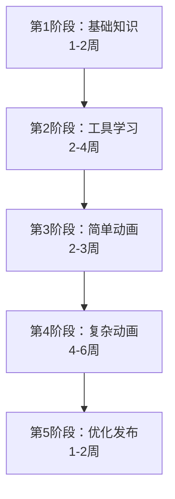

# VRM 动画制作自学指南

## 📚 目录

1. [学习路径概览](#学习路径概览)
2. [基础知识](#基础知识)
3. [工具链掌握](#工具链掌握)
4. [实践项目](#实践项目)
5. [进阶技巧](#进阶技巧)
6. [资源库](#资源库)

---

## 🎯 学习路径概览



**总学习时长**：10-17 周（每周 5-10 小时）

---

## 📖 第1阶段：基础知识（1-2周）

### 1.1 3D 动画基础概念

#### 必学知识点：

| 知识点 | 重要性 | 学习时间 | 验收标准 |
|--------|--------|----------|----------|
| 3D 坐标系统 | ⭐⭐⭐⭐⭐ | 2h | 理解 XYZ 轴和旋转 |
| 骨骼（Bones/Joints） | ⭐⭐⭐⭐⭐ | 3h | 知道骨骼层级关系 |
| 关键帧动画 | ⭐⭐⭐⭐⭐ | 4h | 能解释插值原理 |
| 蒙皮（Skinning） | ⭐⭐⭐⭐ | 3h | 理解权重绘制 |
| 动画曲线 | ⭐⭐⭐⭐ | 2h | 认识缓动函数 |
| FK vs IK | ⭐⭐⭐ | 2h | 区分两种控制方式 |

#### 📺 推荐视频教程：

1. **Blender Guru - 动画基础**
   - 平台：YouTube
   - 时长：~4小时
   - 语言：英文（有中文字幕）
   - 链接：搜索 "Blender Guru Animation"

2. **Bilibili - 3D动画入门**
   - 搜索："Blender 动画入门教程"
   - 推荐UP主：琥珀川、Blender小林
   - 语言：中文

#### 📖 阅读材料：

- **《The Animator's Survival Kit》** - 动画圣经（有中文版）
- **Blender 官方文档** - Animation 章节
- **VRM 规范文档** - https://vrm.dev/en/univrm/

#### ✅ 第1阶段考核：

完成后你应该能：
- [ ] 解释什么是关键帧动画
- [ ] 在 Blender 中创建简单的立方体动画
- [ ] 理解骨骼绑定的基本原理
- [ ] 知道 VRM 文件的结构

---

## 🔧 第2阶段：工具链掌握（2-4周）

### 2.1 Blender 基础操作

#### 学习目标：
熟练使用 Blender 进行 3D 建模和动画制作

#### 📋 学习清单：

**Week 1: Blender 界面与基础**
- [ ] 安装 Blender（最新 LTS 版本）
- [ ] 熟悉界面布局
- [ ] 学会基础快捷键（G移动、R旋转、S缩放）
- [ ] 理解视图导航（鼠标中键、数字键）
- [ ] 掌握对象选择和编辑模式切换

**Week 2: 动画模式**
- [ ] Timeline（时间轴）使用
- [ ] Dope Sheet（摄影表）
- [ ] Graph Editor（图表编辑器）
- [ ] NLA Editor（非线性动画编辑器）
- [ ] 关键帧插入（I键）

**Week 3-4: 骨骼与绑定**
- [ ] 创建 Armature（骨架）
- [ ] 理解骨骼父子关系
- [ ] Pose Mode（姿态模式）
- [ ] 权重绘制（Weight Paint）
- [ ] 绑定修改器（Armature Modifier）

#### 🎬 实践项目：
**制作一个简单的人物挥手动画**
- 导入或创建简单人形模型
- 添加骨架
- 绑定骨架到模型
- 制作 2 秒挥手动画

#### 📺 推荐教程：

**中文资源**：
1. **"Blender 2023 完整入门教程"** - Bilibili
   - UP主：琥珀川
   - 时长：~8小时
   - 涵盖建模、材质、动画

2. **"Blender骨骼绑定教程"** - Bilibili
   - 搜索关键词："Blender 人物绑定"
   - 推荐：蛋蛋老师、小林教程

**英文资源**（质量更高）：
1. **"Blender Character Animation for Beginners"** - YouTube
   - Grant Abbitt 或 CG Geek
   - 系统全面

### 2.2 VRM 工具链

#### 必装工具：

| 工具 | 用途 | 安装方式 | 难度 |
|------|------|----------|------|
| **VRM Add-on for Blender** | Blender 中导入/导出 VRM | GitHub 下载 | ⭐⭐ |
| **UniVRM (Unity)** | Unity 中处理 VRM | Unity Asset Store | ⭐⭐⭐ |
| **VRoid Studio** | 快速创建 VRM 模型 | 官网下载 | ⭐ |
| **3dRetarget** | 动画格式转换 | 在线工具 | ⭐ |

#### 🔧 安装 VRM Add-on for Blender：

```bash
# 步骤
1. 访问：https://github.com/saturday06/VRM-Addon-for-Blender
2. 下载最新 Release（.zip 文件）
3. Blender → Edit → Preferences → Add-ons
4. 点击 "Install..." → 选择下载的 .zip
5. 启用 "VRM format"
6. 保存设置
```

#### 📖 学习资源：

**VRM Add-on 官方文档**：
- https://vrm-addon-for-blender.info/en/
- 包含导入、编辑、导出教程

**VRoid Studio 教程**：
- 官网：https://vroid.com/studio
- Bilibili 搜索："VRoid Studio 入门"
- 适合快速创建测试模型

#### ✅ 第2阶段考核：

完成后你应该能：
- [ ] 在 Blender 中制作 5 秒的简单人物动画
- [ ] 导入/导出 VRM 模型
- [ ] 使用 VRoid Studio 创建基础角色
- [ ] 理解 VRM 骨骼结构

---

## 🎨 第3阶段：简单动画制作（2-3周）

### 3.1 制作你的第一个 VRMA 动画

#### 项目：挥手动画

**准备工作**：
1. 准备一个 VRM 模型（可以用 VRoid Studio 创建）
2. 在 Blender 中导入
3. 确认骨骼层级正确

**制作步骤**：

```
第1步：规划动画（10分钟）
├── 动画时长：2秒（60帧）
├── 关键帧位置：
│   ├── 帧0：初始姿势（手臂放下）
│   ├── 帧10：手臂抬起开始
│   ├── 帧20：手臂完全抬起
│   ├── 帧30：手向左摇
│   ├── 帧40：手向右摇
│   ├── 帧50：手向左摇
│   └── 帧60：回到初始姿势

第2步：设置初始姿势（15分钟）
├── 进入 Pose Mode
├── 选择右臂骨骼
├── 调整到自然站立姿势
└── 插入关键帧（I → Location & Rotation）

第3步：创建关键帧（30分钟）
├── 移动到帧10 → 抬手 → 插入关键帧
├── 移动到帧20 → 完全抬起 → 插入关键帧
├── 重复其他关键帧
└── 预览动画（Space键）

第4步：调整动画曲线（20分钟）
├── 打开 Graph Editor
├── 选择曲线 → 调整缓动
├── 使手部动作更自然
└── 添加细节（手指动作等）

第5步：导出 VRMA（5分钟）
├── File → Export → VRM Animation (.vrma)
├── 选择导出路径
├── 检查选项（勾选 Reduce Keyframes）
└── 导出
```

#### 🎯 练习项目列表：

| 项目 | 难度 | 时长 | 技能点 |
|------|------|------|--------|
| 挥手 | ⭐ | 2h | 手臂旋转、时间把握 |
| 点头 | ⭐ | 1h | 头部动画、循环 |
| 鞠躬 | ⭐⭐ | 2h | 脊柱弯曲、平衡 |
| 拍手 | ⭐⭐ | 3h | 双手协调、音效同步 |
| 思考动作 | ⭐⭐⭐ | 4h | 手势、头部、身体组合 |

#### 📺 推荐教程：

**"VRM动画制作实战"** - Bilibili
- 搜索："VRM 动画 Blender"
- 关注实战型教程（而非纯理论）

### 3.2 动画优化技巧

#### 让动画更自然的12条黄金法则：

1. **预备动作**（Anticipation）
   - 挥手前先微微后撤
   - 跳跃前先下蹲

2. **跟随和重叠动作**（Follow Through）
   - 手臂停止，手指还在动
   - 头发、衣物的延迟

3. **缓入缓出**（Ease In & Out）
   - 使用曲线编辑器调整
   - 避免线性插值

4. **弧线运动**（Arc）
   - 人体关节沿弧线移动
   - 不要直线移动

5. **次要动作**（Secondary Action）
   - 挥手时身体微微倾斜
   - 说话时眉毛动作

#### 🔧 Blender 优化工具：

```python
# 一键优化关键帧脚本（在 Blender Text Editor 中运行）
import bpy

def optimize_animation():
    # 选中所有骨骼
    for bone in bpy.context.object.pose.bones:
        # 获取所有 F-Curves
        for fcurve in bpy.context.object.animation_data.action.fcurves:
            # 添加平滑修改器
            mod = fcurve.modifiers.new('SMOOTH')
            mod.factor = 0.3
    
    print("✅ 动画优化完成")

optimize_animation()
```

#### ✅ 第3阶段考核：

完成后你应该能：
- [ ] 独立制作 5 个基础动画（挥手、点头等）
- [ ] 导出 VRMA 文件并在 AITuber 中测试
- [ ] 理解动画原理的基本法则
- [ ] 使用曲线编辑器优化动画

---

## 🚀 第4阶段：复杂动画（4-6周）

### 4.1 全身动画协调

#### 高级项目：庆祝动作

**涉及技能**：
- 全身协调（头、手、身、腿）
- 情绪表达
- 动态平衡
- 面部表情（BlendShapes）

#### 制作流程：

```
Week 1: 动作设计
├── 参考视频（YouTube 搜索 "celebration animation reference"）
├── 绘制关键姿势草图
├── 规划动画时序（3-5秒）
└── 分解为子动作

Week 2: 粗略动画（Blocking）
├── 只设置关键姿势
├── 检查动作流程
├── 调整时序
└── 获取反馈

Week 3: 细化动画（Refining）
├── 添加过渡帧
├── 调整曲线
├── 添加次要动作
└── 面部表情同步

Week 4: 抛光（Polishing）
├── 微调细节
├── 添加手指动作
├── 检查穿模问题
└── 导出测试
```

### 4.2 动作捕捉数据应用

#### 使用 Mixamo 动画：

**优点**：
- 高质量动作捕捉
- 快速原型制作
- 学习专业动画

**工作流程**：

```
Mixamo → FBX 下载 → 3dRetarget 转换 → VRMA 导入 Blender → 微调 → 导出
```

**微调要点**：
1. **手部调整**：Mixamo 手势可能不自然
2. **面部表情**：需要手动添加
3. **循环优化**：首尾帧对齐
4. **骨骼映射**：确认 VRM 骨骼对应正确

#### 📺 推荐教程：

**"Mixamo 动画转 VRM 完整教程"**
- 平台：Bilibili
- 搜索："Mixamo VRM Blender"

### 4.3 表情动画（BlendShapes）

#### VRM 标准表情：

```typescript
// VRM 1.0 标准表情
const expressions = [
  'neutral',    // 中性
  'happy',      // 开心
  'sad',        // 伤心
  'angry',      // 生气
  'surprised',  // 惊讶
  'relaxed',    // 放松
  'aa',         // 口型 あ
  'ih',         // 口型 い
  'ou',         // 口型 う
  'ee',         // 口型 え
  'oh',         // 口型 お
  'blink',      // 眨眼
  'blinkLeft',  // 左眼眨
  'blinkRight', // 右眼眨
  'lookUp',     // 看上
  'lookDown',   // 看下
  'lookLeft',   // 看左
  'lookRight',  // 看右
]
```

#### 在 Blender 中编辑表情：

1. **导入 VRM 模型**
2. **进入 Shape Keys 面板**
3. **创建新的 Shape Key** → 命名为表情名
4. **进入编辑模式** → 调整顶点位置
5. **设置权重** → 测试表情效果
6. **导出时包含 BlendShapes**

#### ✅ 第4阶段考核：

完成后你应该能：
- [ ] 制作 3-5 秒的复杂全身动画
- [ ] 从 Mixamo 转换并调整动画
- [ ] 创建或编辑面部表情
- [ ] 理解动画原理的12条法则
- [ ] 解决常见问题（穿模、抖动等）

---

## 🎓 第5阶段：优化与发布（1-2周）

### 5.1 动画文件优化

#### 减小文件大小：

```python
# Blender 优化脚本
import bpy

def optimize_vrma():
    action = bpy.context.object.animation_data.action
    
    # 1. 删除冗余关键帧
    for fcurve in action.fcurves:
        fcurve.convert_to_samples(0, 250)  # 采样
        fcurve.convert_to_keyframes(0, 250)  # 转回关键帧
    
    # 2. 减少精度
    for fcurve in action.fcurves:
        for keyframe in fcurve.keyframe_points:
            keyframe.co.y = round(keyframe.co.y, 3)
    
    # 3. 删除静止通道
    for fcurve in action.fcurves:
        values = [kp.co.y for kp in fcurve.keyframe_points]
        if len(set(values)) == 1:  # 所有值相同
            action.fcurves.remove(fcurve)
    
    print("✅ 优化完成")

optimize_vrma()
```

#### 性能优化清单：

- [ ] 删除不必要的关键帧（< 5% 变化）
- [ ] 简化曲线（Simplify Curve）
- [ ] 移除静止骨骼的动画数据
- [ ] 降低关键帧密度（保持质量）
- [ ] 压缩文件（gzip）

### 5.2 质量检查

#### 测试清单：

| 检查项 | 工具 | 标准 |
|--------|------|------|
| 播放流畅 | AITuber Kit | 30+ FPS |
| 无穿模 | Blender | 视觉检查 |
| 循环无缝 | 比较首尾帧 | < 1° 误差 |
| 文件大小 | 文件管理器 | < 500KB |
| 骨骼映射 | Three.js | 所有骨骼正确 |
| 表情同步 | 实时预览 | 嘴型匹配 |

### 5.3 发布与分享

#### 文档模板：

```markdown
# 动画名称：挥手问候 (Wave Greeting)

## 基本信息
- **时长**：2 秒
- **帧数**：60 帧
- **文件大小**：234 KB
- **支持 VRM 版本**：1.0
- **制作工具**：Blender 3.6 + VRM Add-on

## 使用说明
1. 将 `wave.vrma` 放到 `public/animations/` 目录
2. 在 `animationController.ts` 中添加映射
3. 通过 `emotion="wave"` 触发

## 预览


## 已知问题
- 无

## 授权
- MIT License（可自由使用、修改、分发）
```

#### ✅ 第5阶段考核：

完成后你应该能：
- [ ] 优化动画文件大小（< 原始大小的 50%）
- [ ] 完成完整的测试流程
- [ ] 编写清晰的使用文档
- [ ] 理解 VRMA 格式的技术细节

---

## 📚 资源库

### 官方文档

| 资源 | 链接 | 重要性 |
|------|------|--------|
| VRM 规范 | https://vrm.dev/ | ⭐⭐⭐⭐⭐ |
| VRM Animation 1.0 | https://github.com/vrm-c/vrm-specification | ⭐⭐⭐⭐⭐ |
| Blender 官方文档 | https://docs.blender.org/ | ⭐⭐⭐⭐⭐ |
| Three.js VRM | https://github.com/pixiv/three-vrm | ⭐⭐⭐⭐ |

### 在线工具

- **3dRetarget**: https://3dretarget.com/zh
- **Mixamo**: https://www.mixamo.com/
- **VRoid Hub**: https://hub.vroid.com/
- **Sketchfab**: https://sketchfab.com/ (参考模型)

### 视频教程（中文）

#### Bilibili 推荐UP主：

1. **琥珀川**
   - 专注：Blender 全面教程
   - 适合：初学者
   - 特点：系统完整

2. **Blender小林**
   - 专注：动画制作
   - 适合：进阶学习
   - 特点：实战案例多

3. **蛋蛋老师**
   - 专注：角色绑定
   - 适合：中级用户
   - 特点：深入浅出

4. **VTuber 技术研究社**
   - 专注：VRM 相关技术
   - 适合：VRM 专业用户
   - 特点：前沿技术

### 社区资源

| 社区 | 类型 | 语言 |
|------|------|------|
| VRM Consortium Discord | 官方社区 | 英/日 |
| Bilibili 动画区 | 视频教程 | 中文 |
| Blender Artists Forum | 技术讨论 | 英文 |
| VRChat Forums | VRM 应用 | 英文 |
| GitHub Discussions | 开发者社区 | 英文 |

### 书籍推荐

1. **《The Animator's Survival Kit》**
   - 作者：Richard Williams
   - 中文版：《动画师生存手册》
   - 难度：⭐⭐⭐
   - 推荐指数：⭐⭐⭐⭐⭐

2. **《Blender 3D: Designing Objects》**
   - 难度：⭐⭐
   - 推荐指数：⭐⭐⭐⭐

3. **《Character Animation Crash Course》**
   - 作者：Eric Goldberg
   - 难度：⭐⭐⭐⭐
   - 推荐指数：⭐⭐⭐⭐⭐

### 动画参考网站

- **Animation Reference**: https://www.animationreference.com/
- **Mixamo**: https://www.mixamo.com/
- **Locomotion**: http://locomotion.cs.cmu.edu/
- **DeepMotion**: https://www.deepmotion.com/

---

## 🎯 学习里程碑

### 初学者（0-4周）

- [ ] 完成 Blender 基础教程
- [ ] 制作第一个 2 秒动画
- [ ] 导出第一个 VRMA 文件
- [ ] 在 AITuber 中测试动画

### 进阶者（5-10周）

- [ ] 制作 5 个不同类型的动画
- [ ] 使用 Mixamo 并进行微调
- [ ] 理解动画原理的12条法则
- [ ] 能独立解决技术问题

### 高级用户（11-17周）

- [ ] 制作复杂的全身协调动画
- [ ] 创建自定义表情
- [ ] 优化动画性能
- [ ] 分享作品到社区

---

## 💡 学习建议

### 时间管理

**推荐学习计划**（每周 7 小时）：

```
周一 - 周五：每天 1 小时
├── 看教程（30分钟）
└── 实践操作（30分钟）

周六：3 小时集中实践
└── 完整项目制作

周日：休息或复习
└── 整理笔记、查漏补缺
```

### 克服困难

**常见瓶颈与解决方案**：

| 困难 | 原因 | 解决方案 |
|------|------|----------|
| Blender 界面复杂 | 功能太多 | 只学必要功能，先不求全 |
| 动画不自然 | 缺少原理理解 | 多看真人参考视频 |
| 骨骼绑定出错 | 权重问题 | 重新学习权重绘制教程 |
| 导出 VRMA 失败 | 格式不兼容 | 检查 VRM 版本和插件版本 |
| 学习进度慢 | 目标不明确 | 制定小目标，逐个击破 |

### 保持动力

1. **加入社区**
   - Bilibili 关注相关 UP 主
   - 加入 Discord/QQ 群
   - 分享你的进展

2. **设定可见成果**
   - 每周完成一个小动画
   - 记录学习笔记
   - 制作作品集

3. **找到实际应用**
   - 为你的 AITuber 项目制作动画
   - 参与开源项目
   - 接受小型委托

---

## 🚀 快速参考卡

### Blender 快捷键（动画）

| 功能 | 快捷键 | 说明 |
|------|--------|------|
| 插入关键帧 | `I` | Location, Rotation, Scale |
| 删除关键帧 | `Alt + I` | 删除选中的关键帧 |
| 播放动画 | `Space` | 预览动画 |
| 下一帧 | `→` | 移动到下一帧 |
| 上一帧 | `←` | 移动到上一帧 |
| 跳到起点 | `Shift + ←` | 回到第一帧 |
| 跳到终点 | `Shift + →` | 到最后一帧 |
| 切换姿态模式 | `Ctrl + Tab` | 切换编辑/姿态模式 |
| 清除位置 | `Alt + G` | 清除位移 |
| 清除旋转 | `Alt + R` | 清除旋转 |
| 清除缩放 | `Alt + S` | 清除缩放 |

### VRM 骨骼标准名称

```
hips (根骨骼)
├── spine
│   ├── chest
│   │   ├── neck
│   │   │   └── head
│   │   ├── leftShoulder
│   │   │   └── leftUpperArm
│   │   │       └── leftLowerArm
│   │   │           └── leftHand
│   │   └── rightShoulder
│   │       └── rightUpperArm
│   │           └── rightLowerArm
│   │               └── rightHand
├── leftUpperLeg
│   └── leftLowerLeg
│       └── leftFoot
└── rightUpperLeg
    └── rightLowerLeg
        └── rightFoot
```

---

## 📞 获取帮助

### 遇到问题时的解决流程：

```
1. 检查错误信息 → 记录关键词
   ↓
2. 搜索官方文档 → 查找相关章节
   ↓
3. Google/百度搜索 → "Blender + 错误信息"
   ↓
4. 查看社区讨论 → Bilibili 评论区、知乎
   ↓
5. 提问（附上详细信息）→ Discord、QQ群
```

### 提问模板：

```markdown
**问题描述**：
我在尝试导出 VRMA 文件时遇到 XXX 错误

**环境信息**：
- Blender 版本：3.6 LTS
- VRM Add-on 版本：2.20.0
- 操作系统：macOS 14.0

**复现步骤**：
1. 导入 VRM 模型
2. 创建动画
3. 点击 Export → VRM Animation

**错误信息**：
（粘贴完整错误信息）

**已尝试的解决方案**：
- 重启 Blender
- 重新安装插件

**附件**：
（如果可能，附上截图或文件）
```

---

**最后更新**：2025-12-05  
**维护者**：Ortensia Project Team  
**许可**：CC BY-SA 4.0

---

## 🎓 结语

VRM 动画制作是一个需要**时间和实践**的技能，不要期望一蹴而就。

**记住三个关键点**：
1. **多看参考** - 真人视频、专业动画
2. **多做练习** - 从简单到复杂
3. **多问多分享** - 社区是你最好的老师

**祝你学习顺利！🎉**

如果这份指南对你有帮助，欢迎分享给其他学习者。


